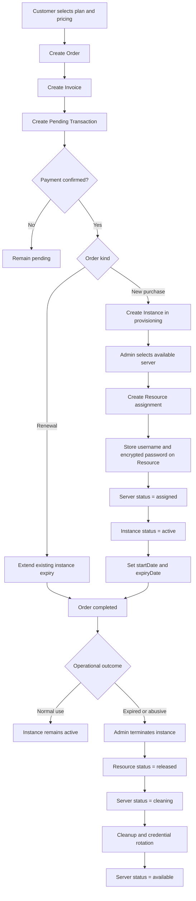
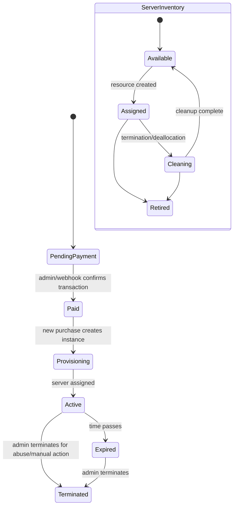

# TrueRDP Business Flow

This document explains the current end-to-end business flow in the codebase.

It is written from an operations and product point of view, but the states and transitions reflect the current implementation in the admin app, web app, and backend.

## Core Concepts

The system has four important layers:

- `Plan`: what the customer buys
- `Order / Invoice / Transaction`: the billing and payment flow
- `Instance`: the customer-facing service lifecycle
- `Server / Resource`: the infrastructure and assignment layer

These are not the same thing and they should stay separate.

## Main Business Entities

### Plan

A plan is the commercial product being sold.

It contains:

- CPU, RAM, storage
- catalog metadata such as plan type, location, OS, bandwidth
- one or more pricing options

### Order

An order is the commercial intent to buy or renew a plan.

It stores:

- which user is buying
- which plan and pricing option was selected
- whether it is a `new_purchase` or `renewal`
- the plan snapshot at purchase time

### Invoice

An invoice is the billing document that represents what the customer owes.

It stores:

- invoice number
- subtotal
- discount
- total amount
- status like `unpaid` or `paid`

### Transaction

A transaction is the payment record or payment attempt tied to the invoice.

It stores:

- payment method
- payment reference
- payment status like `pending`, `confirmed`, or `failed`
- optional link to an existing instance for renewals

### Instance

An instance is the business object representing the customer’s provisioned service.

It stores:

- user
- originating order
- plan
- lifecycle status
- start date
- expiry date

### Server

A server is a reusable infrastructure asset in inventory.

It stores:

- provider
- external ID
- IP address
- hardware specs
- inventory status like `available`, `assigned`, `cleaning`, `retired`

### Resource

A resource is the assignment between an instance and a server.

It stores:

- `instanceId`
- `serverId`
- username
- encrypted password
- assignment status like `active` or `released`

Important:

- Server owns infrastructure details like IP address and hardware
- Resource owns assignment details like credentials and linkage

## New Purchase Flow

### Step 1: Customer selects a plan

The customer visits the web app, chooses a plan, and selects a pricing option.

### Step 2: Checkout creates billing records

Checkout creates:

- an `order` with status `pending_payment`
- an `invoice` with status `unpaid`
- a `transaction` with status `pending`

At this stage:

- no server is assigned
- no resource is created
- no active infrastructure is bound to the customer

### Step 3: Payment is confirmed

An admin confirms the pending transaction, or a webhook confirms it.

When confirmation happens:

- transaction becomes `confirmed`
- invoice becomes `paid`
- order becomes `processing`
- a new instance is created in `provisioning`

This is the invoice-first boundary.

The customer has paid, so the system is now allowed to start provisioning work.

## Provisioning Flow

### Step 4: Admin chooses a server

In the admin app, the operator opens the instance and clicks `Provision`.

The admin chooses from the pool of servers that are currently `available`.

The admin may also optionally enter:

- username
- password

These credentials are not stored on the server record.

They are stored on the `resource` assignment because credentials belong to the instance-to-server binding, not to inventory itself.

### Step 5: Allocation happens

Provisioning performs the following business actions:

- checks that the instance is in `provisioning`
- checks that the chosen server is `available`
- creates a `resource` linking the instance and server
- stores optional username and encrypted password on that resource
- updates the server to `assigned`
- updates the instance to `active`
- sets the instance `startDate`
- sets the instance `expiryDate` based on the purchased duration
- marks the order `completed`

At this point the customer has a live service.

## Renewal Flow

Renewals are different from new purchases.

### Step 1: Customer starts a renewal

The system creates:

- an order with kind `renewal`
- an invoice
- a pending transaction

### Step 2: Payment is confirmed

When the renewal transaction is confirmed:

- the existing instance is found
- the expiry date is extended
- the instance remains or becomes `active`
- the order becomes `completed`

In the current flow:

- renewals do not allocate a new server
- renewals do not create a new resource

They only extend service time.

## Expiry and Termination Flow

### Expiry

When an instance reaches expiry, it becomes part of the operational review flow in admin.

Admins can decide whether to:

- extend it
- terminate it

### Manual Termination

Admins can manually terminate an instance, including for abuse or policy reasons.

When termination happens:

- the active resource is marked `released`
- the linked server is moved to `cleaning`
- the instance is marked `terminated`

This is important because termination does not immediately return the server to `available`.

The server goes through a cleanup stage first.

## Server Cleanup Flow

After termination, the server lifecycle is:

- `assigned` -> `cleaning` -> `available`

The current system expects cleanup to happen operationally.

Typical cleanup work includes:

- resetting passwords
- removing customer data
- rotating credentials
- reinstalling or refreshing the environment if needed

Once cleanup is complete, admin can move the server back to `available`.

## Operational States

### Order Status

- `pending_payment`: customer started checkout but payment not confirmed
- `processing`: payment confirmed, provisioning work pending or ongoing
- `completed`: provisioning or renewal completed
- `cancelled`: cancelled order

### Invoice Status

- `unpaid`
- `paid`
- `expired`

### Transaction Status

- `pending`
- `confirmed`
- `failed`

### Instance Status

- `pending`
- `provisioning`
- `active`
- `expired`
- `termination_pending`
- `terminated`
- `failed`

Note:

The intended main lifecycle for a new purchase is:

- `provisioning` -> `active` -> `expired` -> `terminated`

### Server Status

- `available`
- `assigned`
- `cleaning`
- `retired`

### Resource Status

- `active`
- `released`

## Practical Summary

The current business flow is:

1. Customer chooses a plan
2. System creates order, invoice, and transaction
3. Payment is confirmed
4. System creates a provisioning instance
5. Admin selects an available server
6. System creates a resource binding
7. Server becomes assigned
8. Instance becomes active
9. On expiry or abuse, admin can terminate
10. Resource is released and server moves to cleaning
11. After cleanup, server returns to available

## Visual Flow

### State Lifecycle Snapshot

## Important Separation Rules

- Invoice is not the same as transaction
- Instance is not the same as server
- Resource is not the same as server
- Credentials belong on resource assignment, not on server inventory
- A server can exist without a customer
- A customer instance should not be attached to a server until payment is confirmed

## Current Admin Responsibilities

Today, the admin team is responsible for:

- confirming pending payments
- provisioning instances after payment
- choosing inventory servers
- optionally entering assignment credentials
- extending instances
- terminating abusive or expired instances
- cleaning and returning servers to inventory
