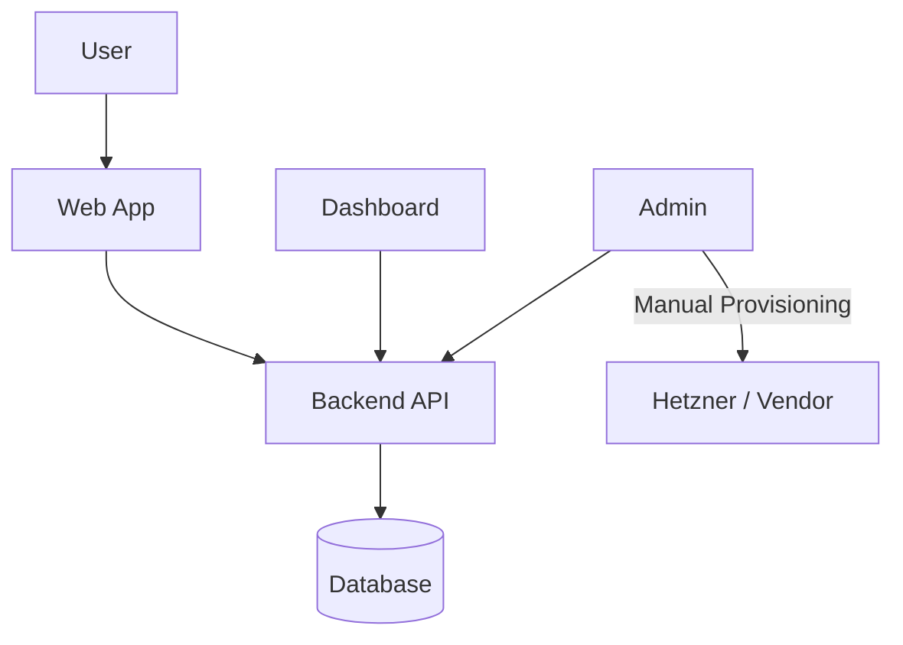
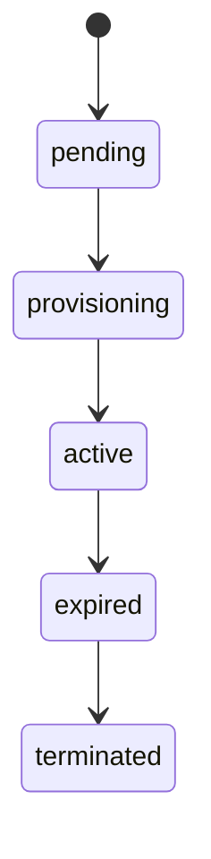
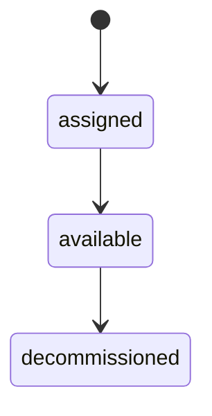
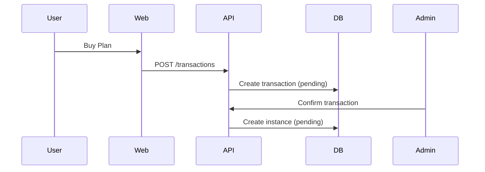
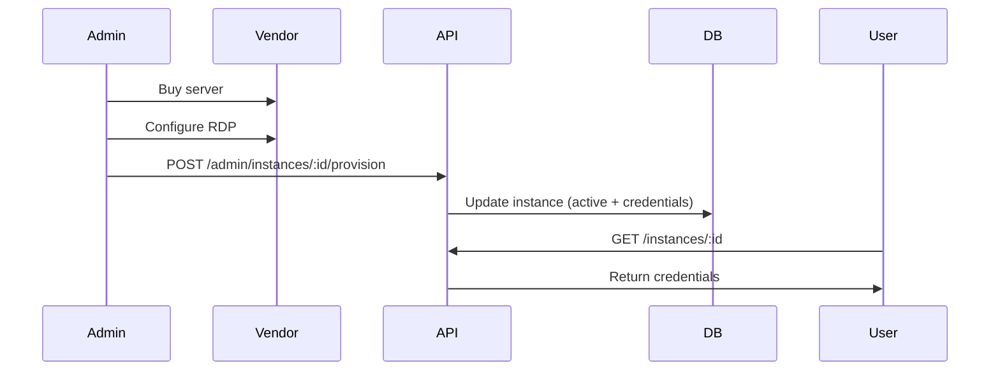
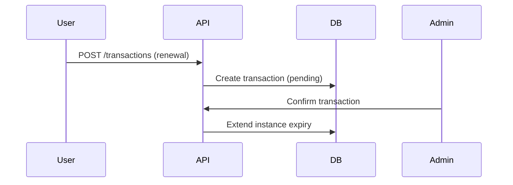
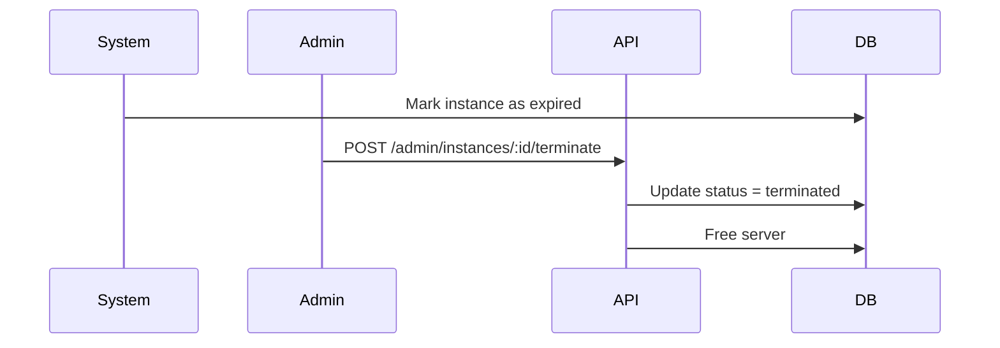
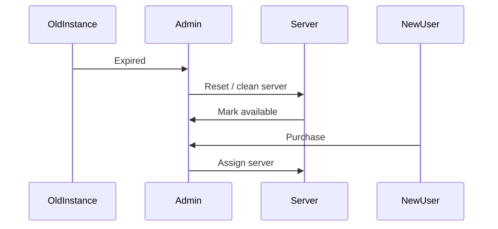

# TrueRDP Architecture

## System Type

Manual-first RDP provisioning system (automation-ready).

## Database

PostgreSQL (mandatory).

Reason:

- Strong relational integrity
- Supports constraints and enums for lifecycle enforcement

## Core Principle

System controls state. Human executes provisioning.

## Components

- Frontend (React)
- Backend (Fastify)
- Database (PostgreSQL)
- Infrastructure (manual servers)

---

## 1. System Overview (HLD)

TrueRDP is a managed RDP SaaS platform where:

- Users purchase RDP plans
- Admin manually provisions servers (on-demand)
- Instances follow lifecycle: pending -> active -> expired -> terminated
- Servers are reused or decommissioned based on demand

Design philosophy:

- Human-in-the-loop
- Low upfront cost
- Lifecycle-driven system

---

## 2. Monorepo Architecture

- `/apps/web` -> Marketing + Auth (public)
- `/apps/dashboard` -> User dashboard
- `/apps/admin` -> Admin panel
- `/apps/backend` -> API (Fastify)

---

## 3. Deployment Architecture

- `truerdp.com` -> web
- `dashboard.truerdp.com` -> dashboard
- `admin.truerdp.com` -> admin
- `api.truerdp.com` -> backend

---

## 4. High-Level Architecture Diagram



## 5. Domain Model

- User -> owns instances
- Transaction -> purchase or renewal
- Instance -> provisioned RDP for a user
- Server -> infrastructure resource
- Plan -> defines configuration and pricing

## 6. Database Design

### Users

- `id`
- `email`
- `passwordHash`
- `role` (user/admin)

### Plans

- `id`
- `name`
- `cpu`
- `ram`
- `storage`
- `price`
- `durationDays`

### Transactions

- `id`
- `userId`
- `planId`
- `instanceId` (nullable)
- `amount`
- `method` (upi, usdt_trc20)
- `status` (pending, confirmed, failed)
- `createdAt`
- `confirmedAt`

### Instances

- `id`
- `userId`
- `planId`
- `serverId` (nullable)
- `status` (pending, provisioning, active, expired, terminated)
- `ipAddress`
- `username`
- `password`
- `startDate`
- `expiryDate`
- `terminatedAt`

### Servers

- `id`
- `ipAddress`
- `username`
- `password`
- `status` (available, assigned)

## 7. Instance Lifecycle



## 8. Server Lifecycle



## 9. Backend Module Design (LLD)

### Auth Module

Responsibilities:

- Register user
- Login user
- Generate JWT (future: HTTP-only cookies)

Functions:

- `registerUser()`
- `loginUser()`
- `verifyAuthMiddleware()`

### Transaction Module

Responsibilities:

- Create transaction (purchase/renewal)
- Validate plan
- Apply pricing logic
- Link to instance (if renewal)

Functions:

- `createTransaction(userId, planId, method, instanceId?)`
- `getUserTransactions(userId)`

### Instance Module

Responsibilities:

- Fetch user instances
- Fetch instance details
- Track lifecycle state

Functions:

- `getUserInstances(userId)`
- `getInstanceDetails(instanceId)`

### Admin Module

Responsibilities:

- Confirm transactions
- Create instances
- Provision instances
- Terminate instances

Functions:

- `confirmTransaction(txId)`
  - Validate pending transaction
  - Create instance (status: pending)
- `provisionInstance(instanceId, credentials)`
  - Set status -> active
  - Assign credentials
  - Set startDate and expiryDate
- `terminateInstance(instanceId)`
  - Set status -> terminated
  - Free server for reuse

### Pricing Module

Responsibilities:

- Calculate final price

Function:

- `calculatePrice(userId, planId)`

## 10. Frontend Module Design

### Hooks (React Query)

- `useAuth()`
- `useInstances()`
- `useInstance(id)`
- `useTransactions()`

### Components

Dashboard:

- `SummaryCards`
- `PendingAlert`
- `InstanceTable`
- `TransactionsPreview`

Instance Detail:

- `DetailCard`
- `BillingStatus`
- `CredentialsDialog`
- `RenewButton`

Transactions:

- `TransactionsTable`

## 11. Derived State Logic

Billing status:

```js
if (pendingTransactionExists) return "renewal_pending"
if (instance.status === "expired") return "expired"
return "active"
```

## 12. Sequence Diagrams

### 12.1 Purchase Flow



### 12.2 Provisioning Flow (Manual)



### 12.3 Renewal Flow



### 12.4 Expiry -> Termination Flow



### 12.5 Server Reuse Flow



## 13. Business Model Flow

Revenue event:

- User creates transaction

Cost event:

- Admin purchases server from vendor (e.g., Hetzner)

Profit logic:

- Revenue - server cost

Strategy:

- Just-in-time provisioning
- Optional short-term reuse of servers

## 14. System Characteristics

- Manual provisioning (human-in-loop)
- No pre-built server pool
- Lifecycle-based system
- Cost-optimized
- Fully controlled by admin decisions

## 15. Roadmap

### Phase 1 (Core Completion)

- Auth UI (web)
- Cookie-based auth
- Expiry + termination flow

### Phase 2 (Usability)

- Transaction filters
- Dashboard improvements

### Phase 3 (Admin)

- Admin dashboard UI
- Server management UI

### Phase 4 (Scaling)

- Auto provisioning
- Notifications
- Payment integration

## 16. Design Principles

- Separate instance from server
- Do not free server on expiry (only on termination)
- Keep manual control in early stage
- Avoid premature automation
- Build workflows, not isolated APIs
